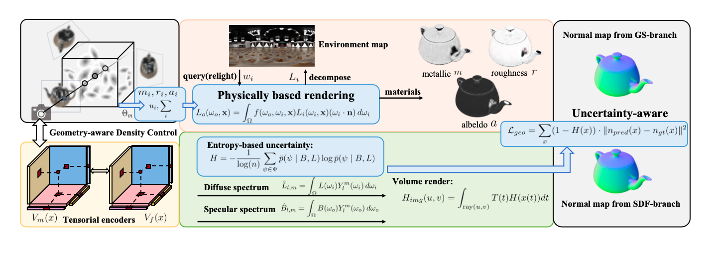

## MU-BGS: Material Uncertainty-Aware Bidirectional Geometry Supervision for Dual-Branch Gaussian Splatting Inverse Rendering


<!--  -->

The method is based on [TensoSDF](https://github.com/Riga2/TensoSDF) and [GS-ROR2](https://github.com/NK-CS-ZZL/GS-ROR)
 and please refer to it to setup the environment.
And then use pip to install the requirements.txt in this project.
```
cd MU-BGS
pip install -r requirements.txt
```




## Datasets
We mainly evaluate our method on [Shiny Blender](https://github.com/google-research/multinerf), [Ref-Real](https://storage.googleapis.com/gresearch/refraw360/ref_real.zip), [Glossy Synthetic](https://github.com/liuyuan-pal/NeRO). [TensoIR dataset](https://zenodo.org/record/7880113#.ZE68FHZBz18) and [Environment Maps](https://drive.google.com/file/d/10WLc4zk2idf4xGb6nPL43OXTTHvAXSR3/view), [Synthetic4Relight](https://drive.google.com/file/d/1wWWu7EaOxtVq8QNalgs6kDqsiAm7xsRh/view) You can use ``nero2blender.py`` to convert the Glossy Synthetic data into Blender format.


### Geometry reconstruction

Below take the "angel" scene as an example:

```
# you need to modify the "dataset_dir" in configs/shape/nerf-nerf/angel.yaml first.

# reconstruct the geometry
python run_training.py --cfg configs/shape/nerf-nerf/angel.yaml

# evaluate the geometry reconstruction results via normal MAE metric
python eval_geo.py --cfg configs/shape/nerf-nerf/angel.yaml
```

Intermediate results will be saved at ```data/train_vis```. Models will be saved at ```data/model```. NVS results will be saved at ```data/nvs```.

### Material reconstruction

```
# you need to modify the "dataset_dir" in configs/shape/nerf-nerf/angel.yaml first.

# estimate the material
python run_training.py --cfg configs/shape/nerf-nerf/angel.yaml

# evaluate the relighting results using the estimated materials via PSNR, SSIM and LPIPS metrics
python eval_mat.py --cfg configs/shape/nerf-nerf/angel.yaml--blender your_blender_path --env_dir your_environment_lights_dir
```
Intermediate results will be saved at ```data/train_vis```. Models will be saved at ```data/model```. Extracted materials will be saved at ```data/materials```. Relighting results will be saved at ```data/relight```.


```
# you need to modify the "dataset_dir" in configs/mat/orb/teapot.yaml first.

# estimate the material
python run_training.py --cfg configs/mat/orb/teapot.yaml

# extract the materials and relight with new environment lights
python eval_mat.py --cfg configs/mat/orb/teapot.yaml --blender your_blender_path --orb_relight_gt_dir your_ORB_GT_relighting_dir --orb_relight_env your_relighting_env_name --orb_blender_dir your_orb_dataset_dir

# evaluate the relighting results via PSNR, SSIM and LPIPS metrics
python eval_orb_relight.py --relight_dir your_relighting_results_dir --gt_dir your_GT_relighting_in_orb_dataset_dir
```
Intermediate results will be saved at ```data/train_vis```. Models will be saved at ```data/model```. Extracted materials will be saved at ```data/materials```. Relighting results will be saved at ```data/relight```.


## TODO List
- [x] Release our checkpoints.


## Acknowledgement

We thank [Zuoliang Zhu](https://nk-cs-zzl.github.io/)  and [KenkanHuang](NJU) for his suggestions during the project.

Here are some great resources we benefit from:
[Ref-Gaussian](https://github.com/fudan-zvg/ref-gaussian), [GS-ROR](https://github.com/NK-CS-ZZL/GS-ROR), [TensoSDF](https://github.com/Riga2/TensoSDF), [IRGS](https://github.com/fudan-zvg/IRGS), [R3DG](https://github.com/NJU-3DV/Relightable3DGaussian), [GeoSpltting](https://github.com/PKU-VCL-Geometry/GeoSplatting) and [GS-IR](https://github.com/lzhnb/GS-IR).

**If you develop/use MU-BGS in your projects, welcome to let us know. We will list your projects in this repository.**