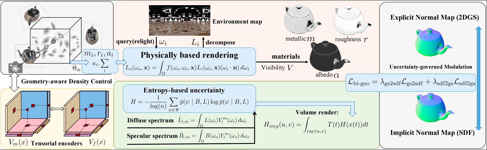

# 🎉 MU-BGS

### Material Uncertainty-Aware Inverse Rendering via Dual-Branch Gaussian Splatting

MU-BGS combines Gaussian splatting and an implicit SDF for geometry reconstruction, material estimation, and inverse rendering.



## 💻 Installation

Set up a CUDA/PyTorch environment following [TensoSDF](https://github.com/Riga2/TensoSDF) and [GS-ROR](https://github.com/NK-CS-ZZL/GS-ROR), including a matching `torchvision` version and [nvdiffrast](https://github.com/NVlabs/nvdiffrast).

```bash
git clone https://github.com/yejun688/MU-BGS.git
cd MU-BGS

pip install -r requirements.txt
pip install ninja matplotlib imageio Pillow trimesh lpips kornia pypng

pip install --no-build-isolation ./submodules/diff-surfel-rasterization
pip install --no-build-isolation ./submodules/simple-knn
pip install --no-build-isolation ./submodules/cubemapencoder
pip install --no-build-isolation ./submodules/raytracing
```

Before running:

- Set the GPU IDs in `run_training.py` and `extract_mesh.py` for your machine.
- In `network/fields.py`, change the absolute BRDF lookup-table path in `ShapeShadingNetwork` to `assets/bsdf_256_256.bin`.
- Run all commands from the repository root.

## 📦 Datasets

| Dataset / Resource | Download |
| --- | --- |
| Shiny Blender | [MultiNeRF](https://github.com/google-research/multinerf) |
| Ref-Real | [Dataset](https://storage.googleapis.com/gresearch/refraw360/ref_real.zip) |
| Glossy Synthetic | [NeRO](https://github.com/liuyuan-pal/NeRO) |
| TensoIR | [Dataset](https://zenodo.org/record/7880113) |
| Synthetic4Relight | [Dataset](https://drive.google.com/file/d/1wWWu7EaOxtVq8QNalgs6kDqsiAm7xsRh/view) |
| Environment Maps | [Download](https://drive.google.com/file/d/10WLc4zk2idf4xGb6nPL43OXTTHvAXSR3/view) |

For the example below, prepare **Blender-format Glossy Synthetic** data with `transforms_train.json`, `transforms_test.json`, and RGBA images. Set `dataset_dir` to the parent of the scene folder, e.g. `/path/to/glossy_synthetic` for `/path/to/glossy_synthetic/angel`.

The Glossy Synthetic format converter is not included. For TensoSDF synthetic and ORB data, follow [TensoSDF](https://github.com/Riga2/TensoSDF).

## 🚀 Quick Start

We use the **angel** scene as an example.

### 1. Geometry reconstruction

Update `dataset_dir` in `configs/shape/nero-nerf/angel.yaml`, then train and extract the mesh:

```bash
python run_training.py --cfg configs/shape/nero-nerf/angel.yaml
python extract_mesh.py --cfg configs/shape/nero-nerf/angel.yaml
```

### 2. Material reconstruction

In `configs/mat/syn/angel-nerf.yaml`, update the following paths:

```yaml
dataset_dir: /path/to/glossy_synthetic
mesh: data/meshes/angel_sdf-180000.ply
geo_model_path: data/model/angel_sdf/model.pth
```

Use the actual exported mesh filename if the training step differs. Then train and evaluate:

```bash
python run_training.py --cfg configs/mat/syn/angel-nerf.yaml
python eval_mat.py --cfg configs/mat/syn/angel-nerf.yaml
```

This exports albedo, roughness, and metallic arrays, and evaluates novel views using **PSNR, SSIM, and LPIPS**.

<details>
<summary>Optional: geometry-stage evaluation</summary>

To skip Gaussian warm-up during evaluation, set the renderer construction in `ShapeTester._init_network()` in `eval_geo.py` to:

```python
self.network = name2renderer[self.cfg['network']](
    self.cfg, training=False
).cuda().eval()
```

Keep the subsequent checkpoint-loading call, then run:

```bash
python eval_geo.py --cfg configs/shape/nero-nerf/angel.yaml
```

This reports PSNR and SSIM. Normal MAE computation is disabled in the current script.

</details>

## 💡 Relighting

Relighting requires **Blender** and currently supports the `tensoSDF` and `orb` dataset types. First train the matching geometry and material configurations and extract the mesh.

Uncomment `matTester.relight()` at the end of `eval_mat.py`, then run, for example:

```bash
python eval_mat.py \
  --cfg configs/mat/syn/compressor.yaml \
  --blender /path/to/blender \
  --env_dir /path/to/environment_maps
```

For this example, use `configs/shape/syn/compressor.yaml` for geometry training. The environment folder should contain `bridge.exr`, `city.exr`, `courtyard.exr`, `interior.exr`, and `night.exr`.

TensoSDF data must include `transforms_val.json`, test `*_normal.png` / `*_diffColor.exr` files, and `test_relight/` ground truth.

<details>
<summary>ORB relighting</summary>

Use `configs/shape/orb/teapot.yaml` and `configs/mat/orb/teapot.yaml` for training. Update their dataset, mesh, and checkpoint paths, then run:

```bash
python eval_mat.py \
  --cfg configs/mat/orb/teapot.yaml \
  --blender /path/to/blender \
  --orb_relight_gt_dir /path/to/orb/ground_truth \
  --orb_relight_env your_environment_name \
  --orb_blender_dir /path/to/orb/blender_LDR
```

</details>

## 📂 Outputs

| Directory | Contents |
| --- | --- |
| `data/model/` | Model checkpoints |
| `data/train_vis/` | Training visualizations |
| `data/meshes/` | Extracted meshes |
| `data/nvs/` | Novel-view renderings and metrics |
| `data/materials/` | Exported material arrays |
| `data/relight/` | Relighting results |
| `output/` | Gaussian-branch outputs |

## 📝 TODO List

- [ ] Release support for the Stanford-ORB dataset.

## 🌷 Acknowledgments

We thank [Zuoliang Zhu](https://nk-cs-zzl.github.io/) for his suggestions.

Our work benefits from [TensoSDF](https://github.com/Riga2/TensoSDF), [GS-ROR](https://github.com/NK-CS-ZZL/GS-ROR), [Ref-Gaussian](https://github.com/fudan-zvg/ref-gaussian), [Ref-NeuS](https://github.com/EnVision-Research/Ref-NeuS), [IRGS](https://github.com/fudan-zvg/IRGS), [R3DG](https://github.com/NJU-3DV/Relightable3DGaussian), [GeoSplatting](https://github.com/PKU-VCL-Geometry/GeoSplatting), and [GS-IR](https://github.com/lzhnb/GS-IR).

If you use MU-BGS in your work, we would love to hear about it!

**License:** See [LICENSE](LICENSE).
